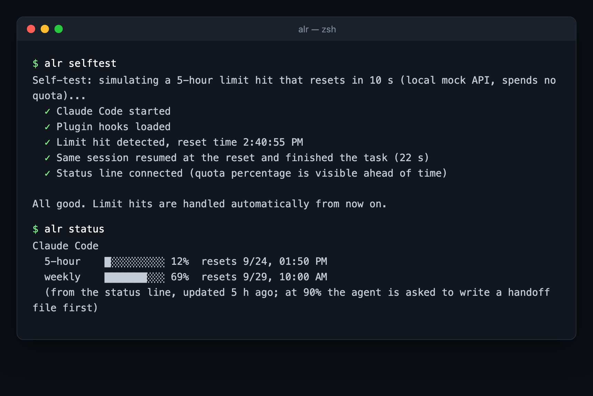

# agent-limit-retry

**Keep Claude Code working through usage limits.** Know the exact reset time, hand off before the limit hits, and run headless jobs that sleep through the reset and resume themselves.

[](https://www.npmjs.com/package/agent-limit-retry)
[](LICENSE)

[](https://retry.autorun.fun)

[中文说明](README.zh-CN.md)

```bash
npx agent-limit-retry    # one question, then the plugin is installed and the status line is tapped
alr selftest                      # simulated limit hit + resume against a local fake API; no quota spent
alr status                        # your 5-hour / 7-day windows, reset times, recent limit hits
```



Restart Claude Code after installing. Everything runs locally: no proxy, no account, no telemetry, no update ping.

## Why

On a Pro/Max plan you have a 5-hour window and a weekly one, and neither waits for a good moment. Claude Code's
own auto-continue covers less than it seems: it continues the *main conversation*, in an *interactive* session,
when the reset is *under 24 hours* away. It does not cover headless `claude -p` runs, weekly limits, or the work
that was in flight when the limit hit.

agent-limit-retry reads what Claude Code already writes (the `rate_limits` it passes to the status line, the
`quotaLimits.resetsAt` field in transcripts) and fills those gaps.

| | Claude Code built-in | agent-limit-retry |
|---|---|---|
| Continue the main conversation after a 5-hour reset (interactive) | ✅ | – |
| Exact reset time of a limit hit + desktop notification | ❌ | ✅ |
| Handoff file written *before* the limit hits (at 90 % of a window) | ❌ | ✅ |
| Headless `claude -p` runs that sleep through the reset and resume the same session | ❌ | ✅ `alr run` |
| Weekly limits | ❌ | ✅ |
| Subagents killed by the limit resumed by id, not re-dispatched | ❌ | [Pro](https://retry.autorun.fun) |

## How it works

Four hooks in a Claude Code plugin, plus a status-line tap. No process sits between you and the API.

1. **Status line tap.** Claude Code passes the status line your plan's `rate_limits` (5-hour and 7-day
   percentages and reset times). alr saves them, then prints your own status line unchanged, or a compact
   `⏳ 5h 62% · 7d 41%` if you had none.
2. **Handoff before the limit** (`PostToolUse`). Once a window passes the threshold, the agent is told to
   finish its current step and write `HANDOFF.md`: goal, what's done, what's in flight, next steps, gotchas.
   Once per window.
3. **Stop guard** (`Stop`). If the agent tries to end the turn without writing the handoff, it gets one
   reminder. It is never blocked twice.
4. **Pick up later** (`SessionStart`). A new or resumed session in that project is pointed at the handoff.
5. **Limit hit** (`StopFailure`). The hit is recorded with its exact reset time and you get a desktop
   notification (macOS, Linux, Windows).

### Unattended runs

```bash
alr run "migrate the test suite to vitest" -- --permission-mode acceptEdits
```

Runs `claude -p`. If the run hits a usage limit, `alr run` reads the exact reset time from the session
transcript, sleeps until then (a laptop that slept through the reset carries on once it wakes), and resumes the
same session with `--resume`, telling the agent to read the handoff first. Weekly limits work the same way.
Keep the process alive in tmux or with `nohup`. `--max-resumes` caps the retries (default 5).

## Pro: subagents that survive the limit

When a limit hits while the main agent has parallel subagents running, every subagent fails at once. Each one
still has its full context on disk and can be woken by id. After the reset the main agent almost never does
that: it re-dispatches the same tasks from scratch (same quota again) or forgets them, and often tries *before*
the reset so they fail twice.

**Pro** finds the subagents a limit (or a crash) cut off, reads what each was doing (task, files changed, last
steps), and once the limit has actually reset tells the main agent to resume them by id. It is silent whenever
Claude Code already handled a case itself. The same for **Codex** (CLI + Desktop, macOS/Windows, plus an
auto-continue watcher since Codex has none) and **ZCode** (GLM Coding Plan).

→ **<https://retry.autorun.fun>** · one-time purchase, full source, installs on top of this package.

## Config

`~/.agent-limit-retry/config.json`

| key | default | |
|---|---|---|
| `threshold` | `90` | percent of a window that triggers the handoff |
| `handoffFile` | `HANDOFF.md` | written in the project root (add it to `.gitignore` if you like) |
| `maxResumes` | `5` | `alr run` gives up after this many resumes |
| `resumeDelaySeconds` | `90` | extra wait after the reset time |
| `notify` | `true` | desktop notification on a limit hit / handoff written |

## FAQ

**Does it need my API key or account?** No. It only reads files Claude Code writes on your machine
(`~/.claude/projects/**/*.jsonl`) and the JSON Claude Code pipes into the status line.

**Will it change my settings?** `alr init` backs up `~/.claude/settings.json` before editing it, keeps an
existing status line and passes the same input through. `alr uninstall` restores everything.

**Requirements.** Node.js 18+, Claude Code ≥ 2.1.234, a Pro or Max plan. API-key users have no usage windows,
so nothing happens.

**Does anything leave my machine?** No. `alr report` writes a JSON file to your desktop with timestamps, event
types and tool names only (no conversation content, no code, project paths hashed) that you can send by hand
when reporting a bug.

**Can it raise my limits or rotate accounts?** No, and it never will. It only helps you use the plan you
already have.

## Changelog

- **0.4.3** — Failed `alr run` / `alr selftest` now print what Claude Code said (e.g. "not logged in") instead of a bare exit code; the self-test says it covers Claude Code only.
- **0.4.2** — Windows: `alr selftest` / `alr report` built a broken `/C:/...` path, so the self-test could not start Claude Code with the plugin; `alr run` and `alr init` now also start the npm `claude.cmd` shim correctly.
- **0.4.1** — English by default (Chinese with a `zh*` locale or `ALR_LANG=zh`); README screenshot.
- **0.4.0** — First public release: open core split from Pro, published to npm as `agent-limit-retry`.

## Development

```bash
npm test                                    # node:test, no dependencies
claude -p "..." --plugin-dir ./plugin       # try the hooks without installing
ALR_HOME=/tmp/x ALR_DEBUG=1 alr ...         # isolated state and hook debug events
```

Bug reports and PRs welcome. If a limit hit wasn't handled, attach the output of `alr report`.

MIT © autorun
